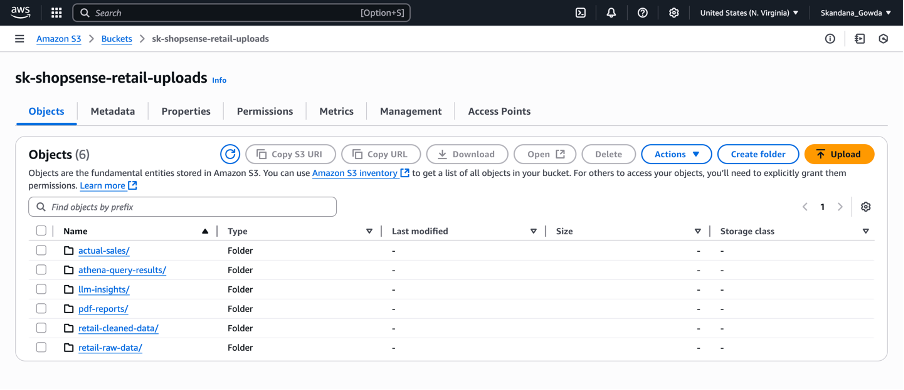
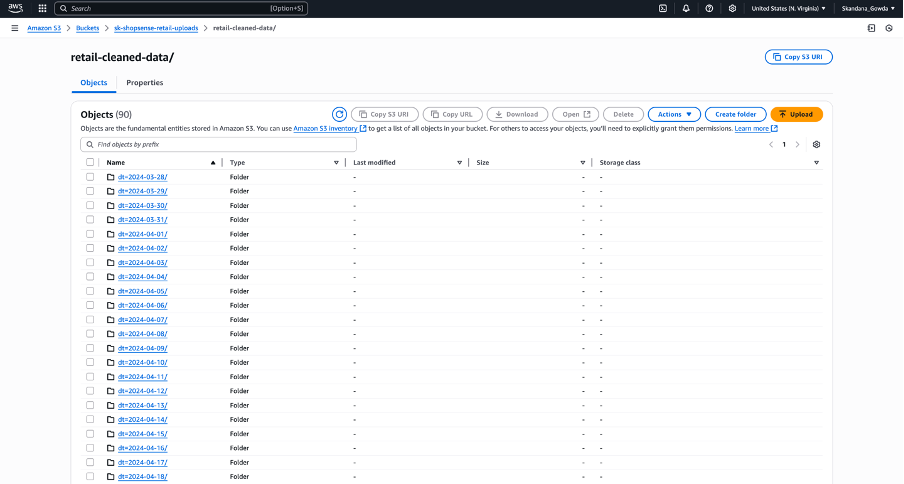
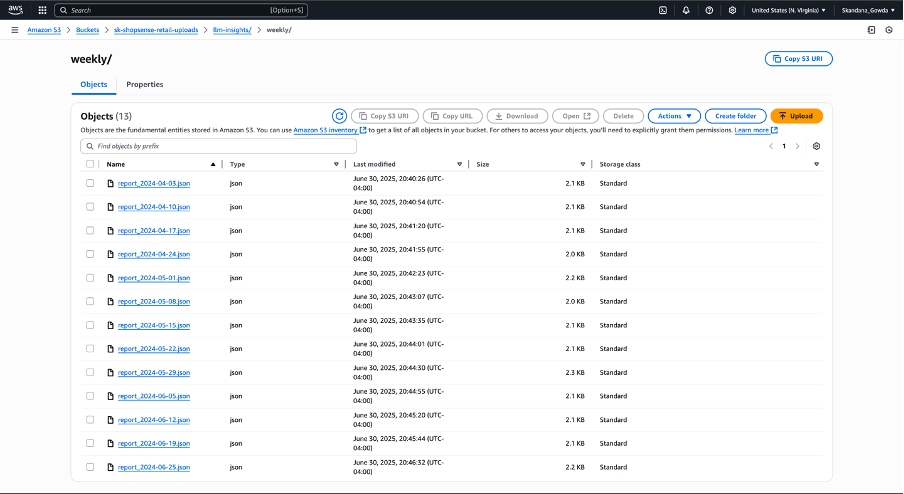
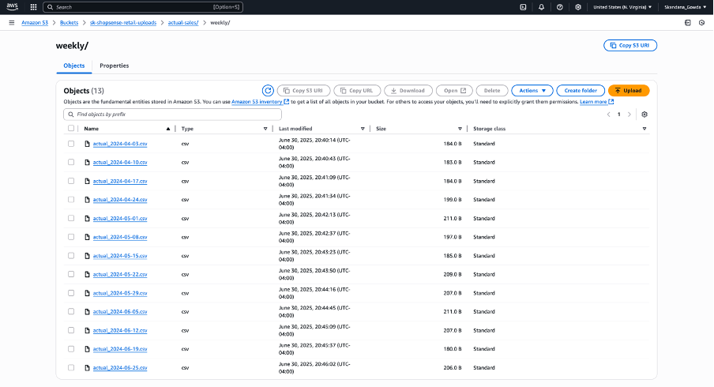
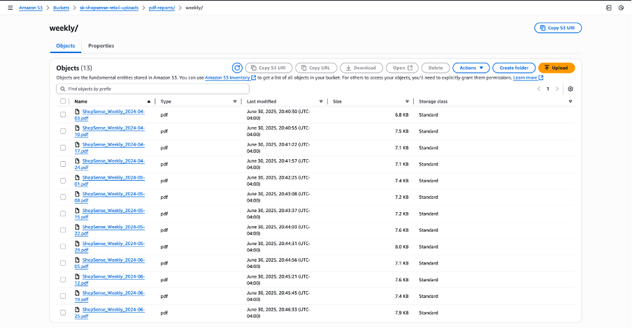
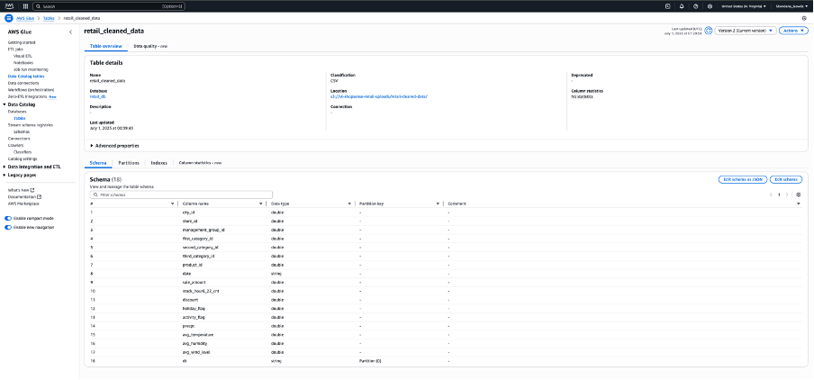
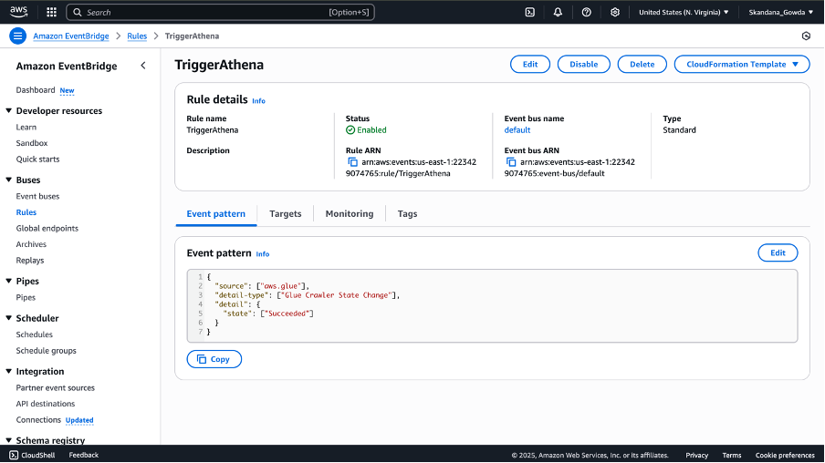
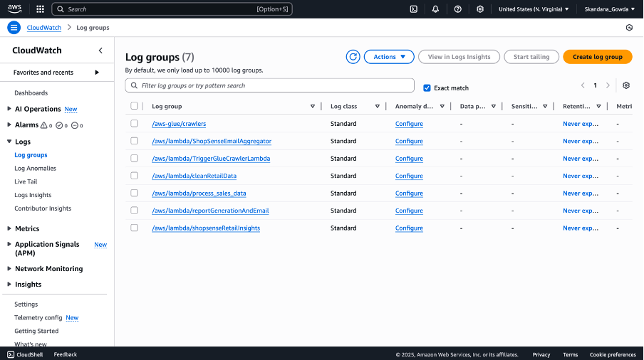

# 🛍️ ShopSense: Automated Retail Insights with AWS Lambda & AI

**ShopSense** is a fully serverless, automated retail analytics pipeline that transforms raw sales data into actionable insights and professional reports — using AWS services and LLMs. From data cleaning to AI-generated PDFs and email delivery, every step is automated with Lambda functions.

---

## 📁 Folder Structure in S3

```
s3://your-bucket/
├── raw/                       # User uploads raw CSV files here
├── cleaned/                   # Cleaned version of raw data (CSV)
├── llm-insights/              # LLM-generated insights (JSON)
├── actual-sales/              # Queried CSV outputs from Athena
├── pdf-reports/               # Final PDF reports (weekly/monthly)
```






---

## ⚙️ How It Works – Lambda by Lambda

### 1️⃣ **DataCleanerLambda**

* **Trigger**: S3 `raw/` folder upload
* **Action**:

  * Cleans raw CSV
  * Standardizes columns
  * Converts data types (e.g., date)
  * Uploads cleaned data to `cleaned/`
* **Layer**: Includes `pandas`, `numpy`, `dateutil`

### 2️⃣ **GlueCrawlerTriggerLambda**

* **Trigger**: S3 `cleaned/` folder upload
* **Action**:

  * Starts AWS Glue Crawler
  * Updates Athena table with new partitions
    
🖼️ 

### 3️⃣ **ShopSenseInsightsLambda**

* **Trigger**: Glue Crawler State Change (Success)
* **Action**:

  * Runs multiple SQL queries via Athena
  * Feeds result + prompt to **OpenRouter's Mistral LLM**
  * Saves JSON response to `llm-insights/`
* **Layer**: Includes `openai`, `boto3`, `pandas`
  
🖼️ 

### 4️⃣ **ReportGeneratorLambda**

* **Trigger**: S3 `llm-insights/` folder upload
* **Action**:

  * Reads LLM JSON
  * Generates PDF with insights and tables
  * Uploads to `pdf-reports/{weekly|monthly}/`
* **Layer**: Includes `PyMuPDF` or `reportlab`

### 5️⃣ **EmailSenderLambda**

* **Trigger**: EventBridge (e.g., every Friday @ 10AM)
* **Action**:

  * Checks for new PDFs in last 7/30 days
  * Creates pre-signed URLs
  * Sends SES email with report links

---

## 🧠 LLM Prompting (Mistral via OpenRouter)

* Used for contextual, human-like summaries of:

  * Co-purchase patterns
  * Weather and holiday impact
  * Top sellers and discount trends
* OpenRouter endpoint + API key stored in `.env`

---

## 📊 Queries Used in Athena

* `top_sellers`
* `holiday_sales`
* `weather_impact`
* `discount_impact`
* `weekly_trend`
* `sales_by_city`
* `co_purchase_simulation`

---

## 📅 Automation via EventBridge

* EventBridge rules trigger Lambda functions on schedule:

  * Weekly insights summary
  * Monthly deep-dive + holiday/weather analysis
* Example cron: `cron(0 10 ? * FRI *)` — every Friday at 10AM

---

## 📧 Emailing via Amazon SES

* Single verified email used for both sender and receiver
* Includes:

  * Custom subject line (Weekly vs Monthly Report)
  * HTML body with clickable links
  * Option to extend to multi-user alerting

---

## 🧪 Testing & Deployment

* **Event Test Cases**: Simulate with test JSON
* **Manual Trigger**: Upload dummy file to raw/
* **CloudWatch Logs**: View per function logs
* **Layers**: Shared dependencies zipped and uploaded

🖼️ 

---

## 🧾 Tech Stack

* **AWS Lambda** (5 total)
* **Amazon S3** (storage)
* **AWS Glue** (crawler)
* **Amazon Athena** (SQL queries)
* **Amazon EventBridge** (automation)
* **Amazon SES** (email delivery)
* **OpenRouter (Mistral LLM)**

---

## 🔐 Secrets & Config

* Store OpenRouter API Key, email, and bucket in `.env`
* Use `dotenv` package to load securely inside Lambda
* All secrets and configs are stored in `.env`:

```env
# AWS Athena
ATHENA_DATABASE=retail_db
ATHENA_OUTPUT_LOCATION=s3://your-output-bucket/query-results/
ATHENA_TABLE=retail_cleaned_data

# OpenRouter
OPENROUTER_API_KEY=your_openrouter_api_key
OPENROUTER_BASE_URL=https://openrouter.ai/api/v1

# SES Email
SES_SENDER_EMAIL=your_verified_sender@example.com
SES_RECEIVER_EMAIL=recipient@example.com
```

---

## 👨‍💻 Author

**Skandana Gowda**
**Built for the AWS Lambda Hackathon**

